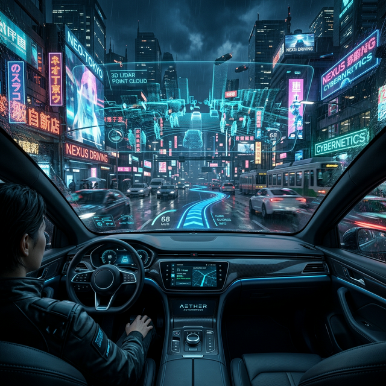
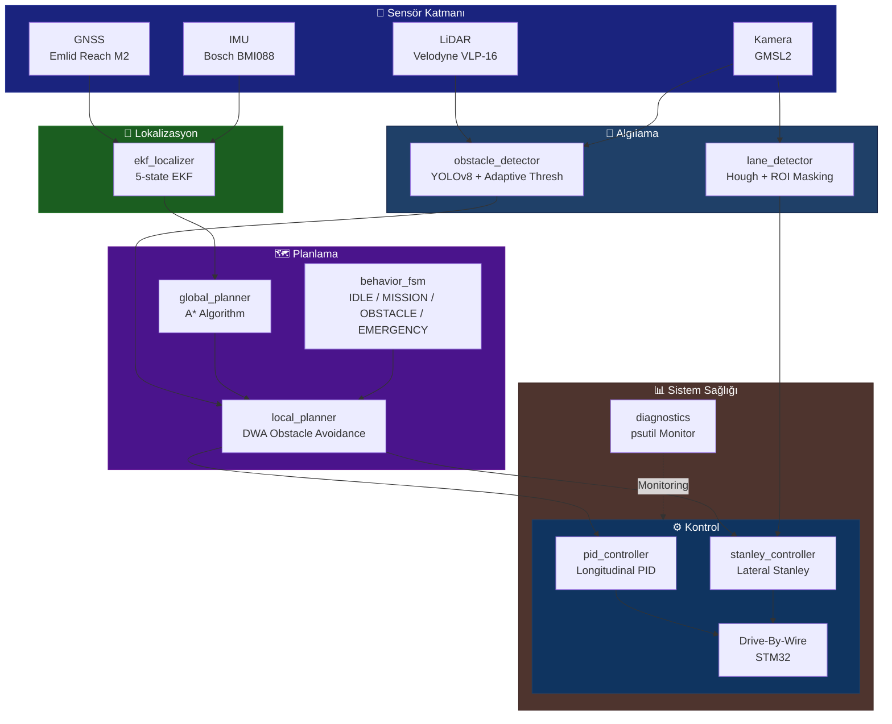

# 🤖 TEKNOFEST Robotaksi Binek Otonom Araç Yarışması
### 🚀 Autonomous Passenger Transport Command Center

<div align="center">



[](https://opensource.org/licenses/MIT)
[](https://www.python.org/)
[](https://docs.ros.org/en/humble/)
[](https://github.com/bahattinyunus/teknofest_robotaksi/actions)
[](https://pytest.org)
[](docker/Dockerfile)
[](https://github.com/bahattinyunus/teknofest_robotaksi)

**"Yolu Görüyoruz, Geleceği Planlıyoruz."**
*"We see the road, we plan the future."*

</div>

---

## � Vizyon (Lore & Vision)
> *"Otonomi sadece kod yazmak değil, bir şehre ruh katmaktır."*

Robotaksi projesi, karmaşık şehir dinamiklerini anlamlandıran, etik kurallar çerçevesinde karar veren ve insan hatasını minimize eden bir **"Yapay Zeka Şoförü"** vizyonuyla geliştirilmektedir. Sadece A noktasından B noktasına gitmiyoruz — geleceğin ulaşım mimarisini kodluyoruz.

---

## �🎯 Görev Tanımı (Mission Directive)
**TEKNOFEST Robotaksi Binek Otonom Araç Yarışması**, şehir içi trafik senaryolarında sürücüsüz, güvenli ve kurallara uygun seyahat edebilen otonom araçlar geliştirmeyi hedefler. Bu depo, aracın **algılama**, **planlama**, **yerelleştirme** ve **kontrol** yeteneklerini yöneten merkezi sinir sistemini barındırır.

> **Hedef:** Tam otonom sürüş ile belirlenen rotayı takip etmek, engellerden kaçınmak ve yolcuları güvenle hedefe ulaştırmak.

---

## 🏗️ Otonom Sürüş Mimarisi (Autonomous Stack)



---

## 🧠 Çekirdek Modüller (Core Modules)

### 📦 Paket Yapısı

```
src/
├── robotaksi_perception/        # Algılama Katmanı
│   ├── obstacle_detector.py     # YOLOv8 + Adaptive Thresholding
│   └── lane_detector.py         # Hough Transform + ROI + CTE
│
├── robotaksi_planning/          # Planlama Katmanı
│   ├── global_planner.py        # A* Grid Planlama
│   └── local_planner.py         # DWA Engel Kaçınma
│
├── robotaksi_control/           # Kontrol Katmanı
│   ├── pid_controller.py        # PID Boylamsal + Stanley Yanal
│   ├── ekf_localizer.py         # 5-State Extended Kalman Filter
│   ├── behavior_fsm.py          # Davranış Durum Makinesi
│   └── diagnostics.py           # Sistem Sağlığı İzleme
│
└── robotaksi_bringup/           # Sistem Başlatma
    └── launch/robotaksi_system.launch.py
```

---

### 🔬 1. Perception (Algılama)

| Modül | Algoritma | Çıktı Topic |
|---|---|---|
| `obstacle_detector` | YOLOv8 + Adaptive Thresh | `/perception/obstacles` |
| `lane_detector` | Hough Transform + Sliding Window | `/perception/lane_viz`, `/perception/lane_cte` |

- **Obstacle Detector:** Modüler `DetectionModel` sınıfı. `mode='yolo'` ile YOLOv8, `mode='adaptive'` ile threshold-based fallback.
- **Lane Detector:** Kamerayı trapez ROI ile maskeler → Canny edge detection → Hough Lines → sol/sağ şerit ayrımı → **Cross-Track Error** (CTE) hesabı.

### 📍 2. Localization (Yerelleştirme)

| Modül | Yöntem | Yayın Frekansı |
|---|---|---|
| `ekf_localizer` | 5-State EKF (GNSS+IMU) | 20 Hz |

- **State Vektörü:** `[x, y, yaw, v, ω]`
- **Ölçüm Güncelleme:** GNSS → `[x, y]` pozisyon; IMU → `[yaw, ω]` yönelim.
- **Flat-Earth GNSS Dönüşümü:** İlk fix'i origin olarak alarak ENU koordinatlarına çevirir.

### �️ 3. Planning (Planlama)

| Modül | Algoritma | Özellik |
|---|---|---|
| `global_planner` | A* (Grid) | 100×100 grid, 2s periyot |
| `local_planner` | DWA | 20Hz, çoklu (v,ω) örnekleme |
| `behavior_fsm` | FSM | 4 durum, event-driven geçişler |

- **Global Planner:** `f(n) = g(n) + h(n)` ile A* skeleton. GridMap yapısı dinamik engel güncellemesine hazır.
- **Local Planner (DWA):** Dinamik pencere içinde `(v, ω)` çiftleri simüle ederek en iyi komut seçilir: `score = goal_score + speed_score - obstacle_score`.
- **Behavior FSM:** `IDLE → MISSION → OBSTACLE → EMERGENCY` geçişleri event-driven.

### ⚙️ 4. Control (Kontrol)

| Modül | Algoritma | Kısıtlar |
|---|---|---|
| `pid_controller` | PID + Anti-Windup | ±1.0 çıkış sınırı |
| `stanley_controller` | Geometrik Lateral | ±0.5 rad direksiyon |
| `diagnostics` | psutil Monitor | >90% CPU → WARN |

---

## 📐 Matematiksel Temeller (Mathematical Core)

### 1. Stanley Kontrolcü
$$\delta(t) = \psi_e(t) + \tan^{-1}\left(\frac{k \cdot e_{cte}(t)}{v(t)}\right)$$

### 2. DWA Skor Fonksiyonu
$$score(v, \omega) = \alpha \cdot goal\_dist^{-1} + \beta \cdot \frac{v}{v_{max}} - \gamma \cdot obstacle\_penalty$$

### 3. EKF Durum Tahmini
$$\mathbf{x}_{k+1} = F \mathbf{x}_k, \quad \mathbf{P}_{k+1} = F \mathbf{P}_k F^T + Q$$

### 4. A* Maliyet Fonksiyonu
$$f(n) = g(n) + h(n), \quad h = \|p_{goal} - p_n\|_2$$

---

## 🧪 Test Altyapısı (CI/CD & Testing)

```
tests/
├── test_controllers.py   # PID + Stanley için 8 pytest senaryosu
└── test_planner.py       # A* Planner için 4 pytest senaryosu
```

```bash
# Tüm testleri çalıştır
pytest tests/ -v --tb=short

# Coverage raporu ile
pytest tests/ --cov=src --cov-report=html
```

**CI Pipeline** (`.github/workflows/ci.yml`):
```
Push → Lint (flake8+isort) → Unit Tests (pytest) → Docker Build → CodeQL Scan
```

---

## 🏎️ Donanım Mimarisi (Hardware Blueprint)

| Bileşen | Model / Özellik | Görevi |
| :--- | :--- | :--- |
| **Compute** | NVIDIA Jetson Orin Nano/Xavier | Derin Öğrenme & Kontrol (30W TDP) |
| **LiDAR** | Velodyne VLP-16 / Robosense RS-Lidar | 360° Engel Tespiti, 100m menzil |
| **Camera** | Leopard Imaging GMSL2 (Sony IMX390) | Şerit & Trafik İşareti Algılama |
| **GNSS** | Emlid Reach M2 (RTK) | ±1cm hassasiyetli konum |
| **IMU** | Bosch BMI088 / VectorNav VN-100 | 6-DOF ölçüm, 200Hz |
| **Drive-By-Wire** | Custom STM32H7 | Gaz/Fren/Direksiyon CAN Bus |
| **Network** | 5G / WiFi 6E | Uzaktan izleme & telemetri |

---

## 🔍 Rakip ve Benzer Yarışma Analizi

| Yarışma | Ölçek | Stack | Şartname |
|---|---|---|---|
| [Formula Student Driverless](https://www.formulastudent.de/fsg/rules/) | 1:1 Araç | ROS2, LiDAR, SLAM | [PDF](https://www.formulastudent.de/fsg/rules/) |
| [F1TENTH](https://f1tenth.org/race.html) | 1:10 Araç | ROS2, LiDAR | [Rules](https://f1tenth.org/race.html) |
| [IGVC](http://www.igvc.org/rules.htm) | 1:1 UGV | ROS, GPS, Stereo | [Rules](http://www.igvc.org/rules.htm) |
| [Indy Autonomous Challenge](https://www.indyautonomouschallenge.com) | Racecar | AV-21, LiDAR+Radar | [Website](https://www.indyautonomouschallenge.com) |

### Açık Kaynak Referanslar
- 🔗 [AMZ Driverless (ETH Zurich)](https://github.com/AMZ-Racing)
- 🔗 [FSD Simulator (ROS2)](https://github.com/FS-Driverless/Formula-Student-Driverless-Simulator)
- 🔗 [F1TENTH Gym (Sim)](https://github.com/f1tenth/f1tenth_gym)
- 🔗 [F1TENTH System](https://github.com/f1tenth/f1tenth_system)
- 🔗 [bitfsd – BIT Driverless](https://github.com/bitfsd/fsd_algorithm)

**💡 Stratejik İlhamlar:**
- **FSD'den** → FastSLAM + koni-bazlı kesin lokalizasyon
- **F1TENTH'ten** → Reaktif, düşük gecikmeli DWA engel kaçınma
- **IGVC'den** → Dış mekan ışık değişimlerinde sağlam şerit takibi

---

## 💻 Command Center (CLI Dashboard)

```bash
python tools/dashboard.py
```
*Sensör verilerini, sistem sağlığını ve otonom sürüş loglarını gerçek zamanlı simüle eder.*

---

## 📚 Dokümantasyon

* [📖 Mimari Detaylar (Architecture Deep-Dive)](docs/ARCHITECTURE.md)
* [🤝 Katkı Rehberi (Contributing)](CONTRIBUTING.md)

---

## 🛠️ Kurulum ve Hazırlık (Setup)

### Gereksinimler
* Ubuntu 22.04 LTS
* ROS 2 Humble Hawksbill
* Python 3.10+
* CUDA 11.x (YOLO için, isteğe bağlı)

```bash
# Depoyu klonlayın
git clone https://github.com/bahattinyunus/teknofest_robotaksi.git
cd teknofest_robotaksi

# Python bağımlılıklarını yükleyin
pip install -r requirements.txt

# ROS 2 çalışma alanını derleyin
colcon build --symlink-install
source install/setup.bash
```

### 🐳 Docker ile Çalıştırma
```bash
docker-compose up --build
```

### 🚗 Simülasyon Başlatma
```bash
# Tüm sistemi başlat (Gazebo / Carla entegrasyonu)
ros2 launch robotaksi_bringup robotaksi_system.launch.py
```

### 🧩 Tekil Node Başlatma
```bash
ros2 run robotaksi_perception obstacle_detector
ros2 run robotaksi_perception lane_detector
ros2 run robotaksi_planning global_planner
ros2 run robotaksi_planning local_planner
ros2 run robotaksi_control ekf_localizer
ros2 run robotaksi_control behavior_fsm
ros2 run robotaksi_control pid_controller
ros2 run robotaksi_control diagnostics
```

---

## 🛣️ Stratejik Yol Haritası (Strategic Roadmap)

### 🟢 2025 – Faz 1: Stabilite & Hassasiyet
- [x] Algılama yığını (YOLOv8 + Lane Detector)
- [x] A* global planlama + DWA lokal planlama
- [x] Stanley + PID kontrol katmanı
- [x] EKF lokalizasyon (GNSS + IMU füzyonu)
- [x] Davranış FSM (IDLE/MISSION/OBSTACLE/EMERGENCY)
- [x] CI/CD pipeline (GitHub Actions)
- [x] pytest tabanlı test altyapısı

### 🟡 2025 Son Çeyrek – Faz 2: Dynamic Intelligence
- [ ] V2X (Vehicle-to-Everything) simülasyonları
- [ ] Sosyal Navigasyon (Social Force Model)
- [ ] End-to-End Deep Learning şerit takibi
- [ ] Trafik ışığı & tabela tanıma entegrasyonu

### 🔴 2026 – Faz 3: Şehir Ölçekli Otonomi
- [ ] Karmaşık kavşak & döner kavşak yönetimi
- [ ] Otonom Vale (Auto-Valet) park sistemi
- [ ] Fleet Management API entegrasyonu
- [ ] HD Map oluşturma (SLAM tabanlı)

---

## 👨‍💻 Author Info

<div align="center">

**Bahattin Yunus Çetin**
*IT Architect | Autonomous Systems Developer | Trabzon, Türkiye*

Otonom sistemler, yapay zeka ve robotik üzerine tutkulu bir mühendis. TEKNOFEST projelerinde inovatif çözümler geliştirmektedir.

[](https://www.linkedin.com/in/bahattinyunus/)
[](https://github.com/bahattinyunus)

</div>

---

## 📜 Lisans
Bu proje [MIT Lisansı](LICENSE) altında lisanslanmıştır.
*Copyright © 2025 Bahattin Yunus Çetin.*

<p align="center">
  
</p>
