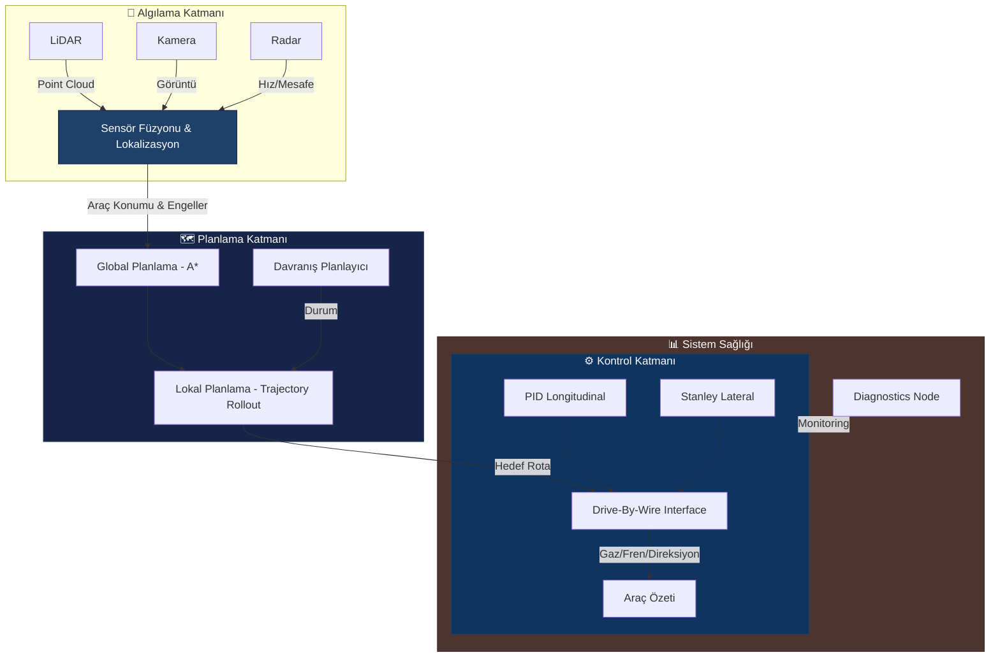

# 🤖 TEKNOFEST Robotaksi Binek Otonom Araç Yarışması
### 🚀 Autonomous Passenger Transport Command Center

<div align="center">


[](https://opensource.org/licenses/MIT)
[](https://www.python.org/)
[](https://docs.ros.org/en/humble/)
[](https://github.com/bahattinyunus/teknofest_robotaksi)

**"Yolu Görüyoruz, Geleceği Planlıyoruz."**
*"We see the road, we plan the future."*

</div>

---

## 🎯 Görev Tanımı (Mission Directive)
**TEKNOFEST Robotaksi Binek Otonom Araç Yarışması**, şehir içi trafik senaryolarında sürücüsüz, güvenli ve kurallara uygun seyahat edebilen otonom araçlar geliştirmeyi hedefler. Bu depo, aracın **algılama**, **planlama** ve **kontrol** yeteneklerini yöneten merkezi sinir sistemini barındırır.

> **Hedef:** Tam otonom sürüş ile belirlenen rotayı takip etmek, engellerden kaçınmak ve yolcuları güvenle hedefe ulaştırmak.

---

## 🏗️ Otonom Sürüş Mimarisi (Autonomous Stack)
Bu proje, yüksek performanslı bir otonom sürüş yığını (stack) üzerine inşa edilmiştir.



### 🧠 Çekirdek Modüller

#### 1. Perception (Algılama)
Dünyayı anlamlandırma modülü.
- **Advanced Detector:** YOLOv8 mimarisi ve fallback olarak adaptif eşikleme (Adaptive Thresholding) ile dinamik engel tespiti.
- **LiDAR Clustering:** DBSCAN/Euclidean Clustering ile engellerin 3D konumlandırılması.
- **Lane Detection:** OpenCV ve Derin Öğrenme tabanlı şerit takibi.

#### 2. Planning (Planlama)
En güvenli ve verimli rotanın hesaplanması.
- **Global Planner:** GPS ve A* algoritması üzerinden ana güzergahın (Waypoints) belirlenmesi.
- **Local Planner:** Anlık engellerden kaçınma (Obstacle Avoidance) ve dinamik hız profili oluşturma.

#### 3. Control (Kontrol)
Fiziksel aracın yönetimi.
- **Stanley Controller:** Yanal kontrol (Direksiyon açısı) için geometrik izleme algoritması.
- **PID Controller:** Boylamsal kontrol (Hız ve ivmelenme) için anti-windup destekli yapı.
- **Velocity Profiling:** Virajlarda ve engel durumunda otomatik hız ayarlama.

#### 4. Diagnostics (Teşhis)
Sistem sağlığının izlenmesi.
- **psutil Monitoring:** CPU ve Bellek kullanımının gerçek zamanlı takibi ve kritik yük uyarısı.

---

## 🔍 Rakip ve Benzer Yarışma Analizi
Otonom araç teknolojileri dünya çapında çeşitli yarışmalarla desteklenmektedir. TEKNOFEST Robotaksi dışında, mimari tasarım ve strateji geliştirirken incelenmesi gereken ana yarışmalar platformları, açık kaynak kodları ve şartnameleriyle aşağıda listelenmiştir:

### 🏎️ Formula Student Driverless (FSD)
Dünya çapındaki üniversite öğrencilerinin otonom yarış araçları geliştirdiği en prestijli etkinliklerden biridir.
- **Kapsam:** Yüksek hızlı otonom sürüş, dinamik engeller, koni tabanlı yol bulma (Trackdrive) ve ivmelenme testleri.
- **Şartname (Kurallar):** [FSG Kurallar Kitapçığı (PDF)](https://www.formulastudent.de/fsg/rules/)
- **Örnek Açık Kaynak Repoları:**
  - [AMZ Driverless (ETH Zurich)](https://github.com/AMZ-Racing) - Sektördeki en iyi otonom öğrenci takımlarından.
  - [FSD Simulator](https://github.com/FS-Driverless/Formula-Student-Driverless-Simulator) - FS-Online ve diğer FSD yarışmaları için topluluk yapımı simülatör. ROS/ROS2 uyumludur.
  - [bitfsd (Beijing Institute of Tech)](https://github.com/bitfsd/fsd_algorithm) - ROS Melodic üzerinde basit ve anlaşılır bir otonom mimari.

### 🚗 F1TENTH
Gerçek Formula 1 araçlarının 1/10 ölçekli otonom versiyonlarıyla yapılan, algoritma verimliliğini hedefleyen yarışma.
- **Kapsam:** Head-to-head hızlı otonom yarış, LiDAR tabanlı SLAM, engel tespiti ve reaktif kontrol.
- **Şartname (Kurallar):** [F1TENTH Resmi Kurallar](https://f1tenth.org/race.html)
- **Örnek Açık Kaynak Repoları:**
  - [F1TENTH Gym](https://github.com/f1tenth/f1tenth_gym) - F1TENTH araçları için 2D simülasyon ortamı.
  - [F1TENTH System](https://github.com/f1tenth/f1tenth_system) - Otonom araç yazılım katmanı (ROS 2 Humble desteği).

### 🤖 Intelligent Ground Vehicle Competition (IGVC)
Dış mekan, otonom askeri/sivil araç tasarımını destekleyen köklü bir yarışma.
- **Kapsam:** GPS tabanlı ara yolu planlaması, şerit takibi (beyaz çizgiler), engel tespiti.
- **Şartname (Kurallar):** [IGVC Kuralları](http://www.igvc.org/rules.htm)
- **Örnek Açık Kaynak Repoları:** Takımlar kendi kodlarını açık kaynak yapmaktadır (Örn: [UKyKORA IGV](https://github.com/UKyKORA/IGV)).

### 🏁 Indy Autonomous Challenge (IAC)
Gerçek boyutlu Indy yarış araçlarıyla yapılan yüksek hızlı otonom yarışması (Hız > 250 km/h).
- **Kapsam:** Multi-agent (çoklu araç) otonom sürüş, yüksek hız aerodinamiği ve karar alma yönetimi.
- Tıpkı Teknofest Robotaksi'deki otoyol ve şehir içi taşıma senaryolarının "ekstrem sınırlarını" temsil ettiği için mimari kararlarda ilham alınacak bir üst aşamadır.

**💡 Bu yarışmalardan alınabilecek stratejik ilhamlar (Robotaksi için):**
- **FSD'den** LiDAR ve koni bazlı kesin lokalizasyon (FastSLAM) teknikleri,
- **F1TENTH'ten** reaktif, düşük gecikmeli engelden kaçınma yaklaşımı,
- **IGVC'den** dış mekan ışık değişimlerinde sağlam şerit bulma algoritmaları,
TEKNOFEST Robotaksi mimarisine doğrudan entegre edilebilecek güçlü alt yapılardır.

---

## 💻 Command Center (CLI Dashboard)
Sistemin durumunu gerçek zamanlı izlemek için geliştirdiğimiz "Command Center" arayüzünü deneyin.

```bash
python tools/dashboard.py
```
*Bu araç; sensör verilerini, sistem sağlığını ve otonom sürüş loglarını simüle eder.*

## 📚 Dokümantasyon
Projenin derinlemesine teknik detayları ve mimari kararlar için:
* [📖 Mimarinin Derinlemesine İncelemesi (Architecture Deep-Dive)](docs/ARCHITECTURE.md)

---

## 🛠️ Kurulum ve Hazırlık (Deployment)

Projenin yerel ortamda çalıştırılması için gerekli adımlar.

### Gereksinimler
* Ubuntu 22.04 LTS
* ROS 2 Humble Hawksbill
* Python 3.8+
* CUDA 11.x (YOLO eğitimi için)

```bash
# Depoyu klonlayın
git clone https://github.com/bahattinyunus/teknofest_robotaksi.git
cd teknofest_robotaksi

# Bağımlılıkları yükleyin
pip install -r requirements.txt

# Çalışma alanını derleyin
colcon build --symlink-install
source install/setup.bash
```

### Simülasyon Başlatma
Proje, **Gazebo** veya **Carla** simülatörleri ile entegre çalışır.
```bash
ros2 launch robotaksi_sim world.launch.py
```

---

## 🌌 Vizyon ve Gelecek (Lore & Vision)
"Otonomi sadece kod yazmak değil, bir şehre ruh katmaktır."
Robotaksi projesi, karmaşık şehir dinamiklerini anlamlandıran, etik kurallar çerçevesinde karar veren ve insan hatasını minimize eden bir **"Yapay Zeka Şoförü"** vizyonuyla geliştirilmektedir. Sadece A noktasından B noktasına gitmiyoruz; geleceğin ulaşım mimarisini kodluyoruz.

---

## 🏎️ Donanım Mimarisi (Hardware Blueprint)
Yazılımımızın gücü, seçtiğimiz endüstriyel standartlardaki donanımlarla buluşuyor.

| Bileşen | Model/Özellik | Görevi |
| :--- | :--- | :--- |
| **Compute Unit** | NVIDIA Jetson Orin Nano / Xavier | Derin Öğrenme & Kontrol |
| **LiDAR** | Velodyne VLP-16 / Robosense | 360° Engel Tespiti |
| **Camera** | Leopard Imaging GMSL2 | Şerit & Trafik İşareti Algılama |
| **IMU/GNSS** | Emlid Reach M2 / Bosch | Hassas Lokalizasyon |
| **V-Box** | Custom STM32 Drive-By-Wire | Fiziksel Araç Kontrolü |

---

## 📐 Matematiksel Temeller (Mathematical Core)
Kontrol ve planlama algoritmalarımız sıkı matematiksel modeller üzerine kuruludur.

### 1. Stanley Kontrolcü (Lateral Control)
Direksiyon açısı ($\delta$), hatat payı ($e$) ve araç hızı ($v$) arasındaki ilişki:
$$\delta(t) = \psi_e(t) + \tan^{-1}\left(\frac{k \cdot e(t)}{v(t)}\right)$$
*Burada $\psi_e$ yönelim hatasını, $k$ ise kazanç parametresini temsil eder.*

### 2. A* Pathfinding (Global Planning)
Düğüm maliyeti hesaplama:
$$f(n) = g(n) + h(n)$$
* $g(n)$: Başlangıçtan düğüme olan gerçek maliyet.
* $h(n)$: Düğümden hedefe olan tahmini (heuristic) maliyet.

---

## 🛣️ Stratejik Yol Haritası (Strategic Roadmap)

### 🟢 2025: Faz 1 - Stabilite & Hassasiyet
- [x] Otonom Sürüş Yığını (Basic Stack) kurulumu.
- [x] Stanley Controller entegrasyonu.
- [x] LiDAR + Kamera Füzyonu (Gelişmiş).

### 🟡 2025 Son Çeyrek: Faz 2 - Dynamic Intelligence
- [ ] V2X (Vehicle-to-Everything) simülasyonları.
- [ ] Dinamik Engellere Karşı Sosyal Navigasyon (Social Navigation).
- [ ] End-to-End Deep Learning ile Şerit Takibi Deneyleri.

### 🔴 2026: Faz 3 - Şehir Ölçekli Otonomi
- [ ] Karmaşık Kavşak & Döner Kavşak Yönetimi.
- [ ] Otonom Vale (Auto-Valet) Park Sistemi.
- [ ] Fleet Management (Filo Yönetimi) API Entegrasyonu.

---

## �‍💻 Author Info

<div align="center">

**Bahattin Yunus Çetin**
*IT Architect | Software Developer | Trabzon, Türkiye*

Otonom sistemler, yapay zeka ve robotik üzerine tutkulu bir mühendis. TEKNOFEST projelerinde inovatif çözümler geliştirmektedir.

[](https://www.linkedin.com/in/bahattinyunus/)
[](https://github.com/bahattinyunus)

</div>

---

## 📜 Lisans
Bu proje [MIT Lisansı](LICENSE) altında lisanslanmıştır.
*Copyright © 2025 Bahattin Yunus Çetin.*

<p align="center">
  
</p>
