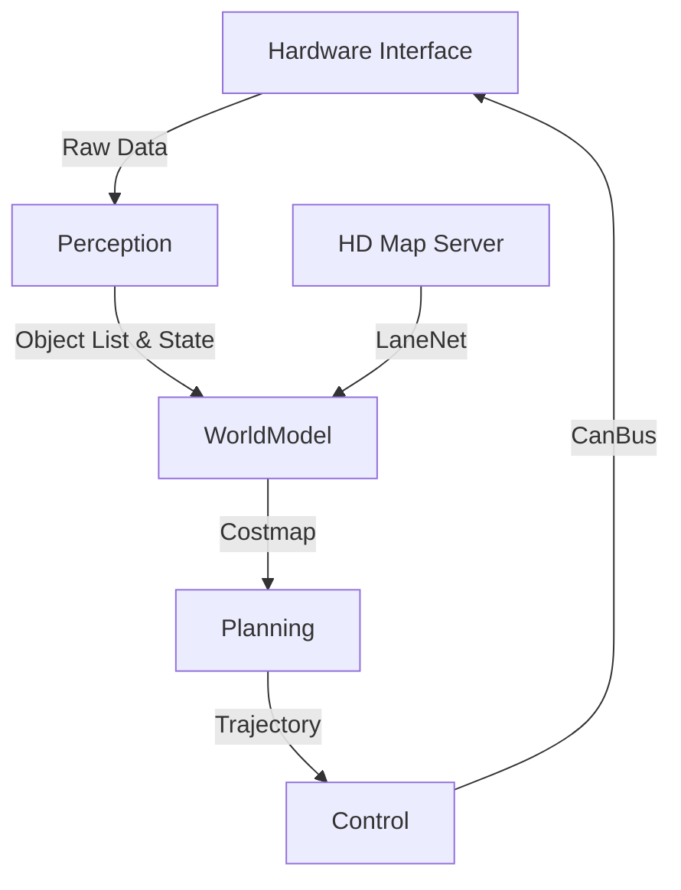

# 🏯 Autonomous System Architecture Deep-Dive

## Overview
The **Teknofest Robotaksi** project employs a modular, service-oriented architecture tailored for urban autonomous driving scenarios. It leverages **ROS 2 Humble** as the middleware backbone, facilitating deterministic communication between the Perception, Planning, and Control layers.

## 1. Hardware Interface Layer (HIL)
This layer abstracts physical sensors and drive-by-wire (DBW) systems.

| Component | Sensor | Data Stream | Topic |
|-----------|--------|-------------|-------|
| **Vision** | ZED 2i Stereo Camera | RGB + Depth | `/camera/image_raw` |
| **Lidar** | Velodyne VLP-16 | PointCloud2 | `/velodyne_points` |
| **IMU** | Xsens MTi-630 | Quaternion/Accel | `/imu/data` |
| **Odometry**| Wheel Encoders | Twist | `/odom` |

## 2. Perception Stack (`robotaksi_perception`)
### Multi-Modal Sensor Fusion
We utilize an **Extended Kalman Filter (EKF)** to fuse odometry, IMU, and visual SLAM data, providing a robust state estimation even in GPS-denied environments.

### Object Detection Pipeline
- **Model:** YOLOv8 (nano/small) optimized with TensorRT.
- **Input:** 640x640 RGB Image.
- **Output:** Bounding boxes (2D) -> Projected to 3D using Lidar depth map.
- **Tracking:** DeepSORT algorithm for ID persistence.

## 3. Planning Stack (`robotaksi_planning`)
### Global Planner
- **Algorithm:** Hybrid A* (A-Star).
- **Function:** Generates a kinematic-feasible path from Waypoint A to B on the HD Map.

### Local Planner (Behavioral)
- **Algorithm:** Model Predictive Path Integral (MPPI) / DWB.
- **Function:** Dynamic obstacle avoidance and smooth velocity profiling. It samples thousands of trajectories to find the optimal control cost.

## 4. Control Stack (`robotaksi_control`)
### Lateral Control
- **Pure Pursuit:** Calculates curvature based on lookahead distance ($ld$).
- **Stanley Controller:** Alternative for low-speed precision parking.

### Longitudinal Control
- **PID:** Classic Proportional-Integral-Derivative controller for throttle/brake mapping.
- **MPC:** Model Predictive Control for considering vehicle dynamics constraints (jerk minimization).

## 5. System Diagram

