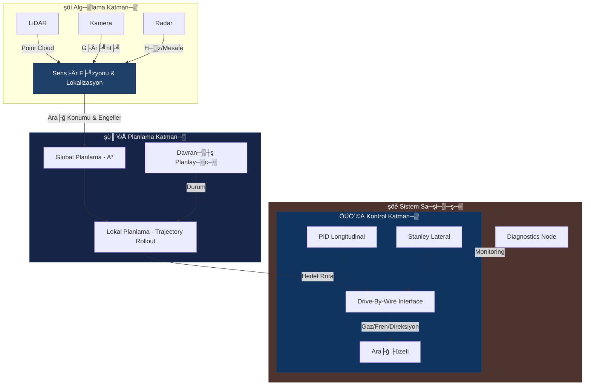

# ´┐¢ TEKNOFEST Robotaksi Binek Otonom Ara├ğ Yar─▒┼şmas─▒
### ­şÜÇ Autonomous Passenger Transport Command Center

<div align="center">


[](https://opensource.org/licenses/MIT)
[](https://www.python.org/)
[](https://docs.ros.org/en/humble/)
[](https://github.com/bahattinyunus/teknofest_robotaksi)

**"Yolu G├Âr├╝yoruz, Gelece─şi Planl─▒yoruz."**
*"We see the road, we plan the future."*

</div>

---

## ´┐¢ G├Ârev Tan─▒m─▒ (Mission Directive)
**TEKNOFEST Robotaksi Binek Otonom Ara├ğ Yar─▒┼şmas─▒**, ┼şehir i├ği trafik senaryolar─▒nda s├╝r├╝c├╝s├╝z, g├╝venli ve kurallara uygun seyahat edebilen otonom ara├ğlar geli┼ştirmeyi hedefler. Bu depo, arac─▒n **alg─▒lama**, **planlama** ve **kontrol** yeteneklerini y├Âneten merkezi sinir sistemini bar─▒nd─▒r─▒r.

> **Hedef:** Tam otonom s├╝r├╝┼ş ile belirlenen rotay─▒ takip etmek, engellerden ka├ğ─▒nmak ve yolcular─▒ g├╝venle hedefe ula┼şt─▒rmak.

---

## ­şÅù´©Å Otonom S├╝r├╝┼ş Mimarisi (Autonomous Stack)
Bu proje, y├╝ksek performansl─▒ bir otonom s├╝r├╝┼ş y─▒─ş─▒n─▒ (stack) ├╝zerine in┼şa edilmi┼ştir.



### ­şğá ├çekirdek Mod├╝ller

#### 1. Perception (Alg─▒lama)
D├╝nyay─▒ anlamland─▒rma mod├╝l├╝.
- **Advanced Detector:** YOLOv8 mimarisi ve fallback olarak adaptif e┼şikleme (Adaptive Thresholding) ile dinamik engel tespiti.
- **LiDAR Clustering:** DBSCAN/Euclidean Clustering ile engellerin 3D konumland─▒r─▒lmas─▒.
- **Lane Detection:** OpenCV ve Derin ├û─şrenme tabanl─▒ ┼şerit takibi.

#### 2. Planning (Planlama)
En g├╝venli ve verimli rotan─▒n hesaplanmas─▒.
- **Global Planner:** GPS ve A* algoritmas─▒ ├╝zerinden ana g├╝zergah─▒n (Waypoints) belirlenmesi.
- **Local Planner:** Anl─▒k engellerden ka├ğ─▒nma (Obstacle Avoidance) ve dinamik h─▒z profili olu┼şturma.

#### 3. Control (Kontrol)
Fiziksel arac─▒n y├Ânetimi.
- **Stanley Controller:** Yanal kontrol (Direksiyon a├ğ─▒s─▒) i├ğin geometrik izleme algoritmas─▒.
- **PID Controller:** Boylamsal kontrol (H─▒z ve ivmelenme) i├ğin anti-windup destekli yap─▒.
- **Velocity Profiling:** Virajlarda ve engel durumunda otomatik h─▒z ayarlama.

#### 4. Diagnostics (Te┼şhis)
Sistem sa─şl─▒─ş─▒n─▒n izlenmesi.
- **psutil Monitoring:** CPU ve Bellek kullan─▒m─▒n─▒n ger├ğek zamanl─▒ takibi ve kritik y├╝k uyar─▒s─▒.

---

## ­şöı Rakip ve Benzer Yar─▒┼şma Analizi
Otonom ara├ğ teknolojileri d├╝nya ├ğap─▒nda ├ğe┼şitli yar─▒┼şmalarla desteklenmektedir. TEKNOFEST Robotaksi d─▒┼ş─▒nda, mimari tasar─▒m ve strateji geli┼ştirirken incelenmesi gereken ana yar─▒┼şmalar platformlar─▒, a├ğ─▒k kaynak kodlar─▒ ve ┼şartnameleriyle a┼şa─ş─▒da listelenmi┼ştir:

### ­şÅÄ´©Å Formula Student Driverless (FSD)
D├╝nya ├ğap─▒ndaki ├╝niversite ├Â─şrencilerinin otonom yar─▒┼ş ara├ğlar─▒ geli┼ştirdi─şi en prestijli etkinliklerden biridir.
- **Kapsam:** Y├╝ksek h─▒zl─▒ otonom s├╝r├╝┼ş, dinamik engeller, koni tabanl─▒ yol bulma (Trackdrive) ve ivmelenme testleri.
- **┼Şartname (Kurallar):** [FSG Kurallar Kitap├ğ─▒─ş─▒ (PDF)](https://www.formulastudent.de/fsg/rules/)
- **├ûrnek A├ğ─▒k Kaynak Repolar─▒:**
  - [AMZ Driverless (ETH Zurich)](https://github.com/AMZ-Racing) - Sekt├Ârdeki en iyi otonom ├Â─şrenci tak─▒mlar─▒ndan.
  - [FSD Simulator](https://github.com/FS-Driverless/Formula-Student-Driverless-Simulator) - FS-Online ve di─şer FSD yar─▒┼şmalar─▒ i├ğin topluluk yap─▒m─▒ sim├╝lat├Âr. ROS/ROS2 uyumludur.
  - [bitfsd (Beijing Institute of Tech)](https://github.com/bitfsd/fsd_algorithm) - ROS Melodic ├╝zerinde basit ve anla┼ş─▒l─▒r bir otonom mimari.

### ­şÜù F1TENTH
Ger├ğek Formula 1 ara├ğlar─▒n─▒n 1/10 ├Âl├ğekli otonom versiyonlar─▒yla yap─▒lan, algoritma verimlili─şini hedefleyen yar─▒┼şma.
- **Kapsam:** Head-to-head h─▒zl─▒ otonom yar─▒┼ş, LiDAR tabanl─▒ SLAM, engel tespiti ve reaktif kontrol.
- **┼Şartname (Kurallar):** [F1TENTH Resmi Kurallar](https://f1tenth.org/race.html)
- **├ûrnek A├ğ─▒k Kaynak Repolar─▒:**
  - [F1TENTH Gym](https://github.com/f1tenth/f1tenth_gym) - F1TENTH ara├ğlar─▒ i├ğin 2D sim├╝lasyon ortam─▒.
  - [F1TENTH System](https://github.com/f1tenth/f1tenth_system) - Otonom ara├ğ yaz─▒l─▒m katman─▒ (ROS 2 Humble deste─şi).

### ­şñû Intelligent Ground Vehicle Competition (IGVC)
D─▒┼ş mekan, otonom askeri/sivil ara├ğ tasar─▒m─▒n─▒ destekleyen k├Âkl├╝ bir yar─▒┼şma.
- **Kapsam:** GPS tabanl─▒ ara yolu planlamas─▒, ┼şerit takibi (beyaz ├ğizgiler), engel tespiti.
- **┼Şartname (Kurallar):** [IGVC Kurallar─▒](http://www.igvc.org/rules.htm)
- **├ûrnek A├ğ─▒k Kaynak Repolar─▒:** Tak─▒mlar kendi kodlar─▒n─▒ a├ğ─▒k kaynak yapmaktad─▒r (├ûrn: [UKyKORA IGV](https://github.com/UKyKORA/IGV)).

### ­şÅü Indy Autonomous Challenge (IAC)
Ger├ğek boyutlu Indy yar─▒┼ş ara├ğlar─▒yla yap─▒lan y├╝ksek h─▒zl─▒ otonom yar─▒┼şmas─▒ (H─▒z > 250 km/h).
- **Kapsam:** Multi-agent (├ğoklu ara├ğ) otonom s├╝r├╝┼ş, y├╝ksek h─▒z aerodinami─şi ve karar alma y├Ânetimi.
- T─▒pk─▒ Teknofest Robotaksi'deki otoyol ve ┼şehir i├ği ta┼ş─▒ma senaryolar─▒n─▒n "ekstrem s─▒n─▒rlar─▒n─▒" temsil etti─şi i├ğin mimari kararlarda ilham al─▒nacak bir ├╝st a┼şamad─▒r.

**­şÆí Bu yar─▒┼şmalardan al─▒nabilecek stratejik ilhamlar (Robotaksi i├ğin):**
- **FSD'den** LiDAR ve koni bazl─▒ kesin lokalizasyon (FastSLAM) teknikleri,
- **F1TENTH'ten** reaktif, d├╝┼ş├╝k gecikmeli engelden ka├ğ─▒nma yakla┼ş─▒m─▒,
- **IGVC'den** d─▒┼ş mekan ─▒┼ş─▒k de─şi┼şimlerinde sa─şlam ┼şerit bulma algoritmalar─▒,
TEKNOFEST Robotaksi mimarisine do─şrudan entegre edilebilecek g├╝├ğl├╝ alt yap─▒lard─▒r.

---

## ­şÆ╗ Command Center (CLI Dashboard)
Sistemin durumunu ger├ğek zamanl─▒ izlemek i├ğin geli┼ştirdi─şimiz "Command Center" aray├╝z├╝n├╝ deneyin.

```bash
python tools/dashboard.py
```
*Bu ara├ğ; sens├Âr verilerini, sistem sa─şl─▒─ş─▒n─▒ ve otonom s├╝r├╝┼ş loglar─▒n─▒ sim├╝le eder.*

## ­şôÜ Dok├╝mantasyon
Projenin derinlemesine teknik detaylar─▒ ve mimari kararlar i├ğin:
* [­şôû Mimarinin Derinlemesine ─░ncelemesi (Architecture Deep-Dive)](docs/ARCHITECTURE.md)

---

## ­şøá´©Å Kurulum ve Haz─▒rl─▒k (Deployment)

Projenin yerel ortamda ├ğal─▒┼şt─▒r─▒lmas─▒ i├ğin gerekli ad─▒mlar.

### Gereksinimler
* Ubuntu 22.04 LTS
* ROS 2 Humble Hawksbill
* Python 3.8+
* CUDA 11.x (YOLO e─şitimi i├ğin)

```bash
# Depoyu klonlay─▒n
git clone https://github.com/bahattinyunus/teknofest_robotaksi.git
cd teknofest_robotaksi

# Ba─ş─▒ml─▒l─▒klar─▒ y├╝kleyin
pip install -r requirements.txt

# ├çal─▒┼şma alan─▒n─▒ derleyin
colcon build --symlink-install
source install/setup.bash
```

### Sim├╝lasyon Ba┼şlatma
Proje, **Gazebo** veya **Carla** sim├╝lat├Ârleri ile entegre ├ğal─▒┼ş─▒r.
```bash
ros2 launch robotaksi_sim world.launch.py
```

---

## ­şæ¿ÔÇı­şÆ╗ Author Info

<div align="center">

**Bahattin Yunus Çetin**
*IT Architect | Software Developer | Trabzon, T├╝rkiye*

Otonom sistemler, yapay zeka ve robotik ├╝zerine tutkulu bir m├╝hendis. TEKNOFEST projelerinde inovatif ├ğ├Âz├╝mler geli┼ştirmektedir.

[](https://www.linkedin.com/in/bahattinyunus/)
[](https://github.com/bahattinyunus)

</div>

---

## ­şô£ Lisans
Bu proje [MIT Lisans─▒](LICENSE) alt─▒nda lisanslanm─▒┼şt─▒r.
*Copyright ┬® 2025 Bahattin Yunus ├çetin.*
