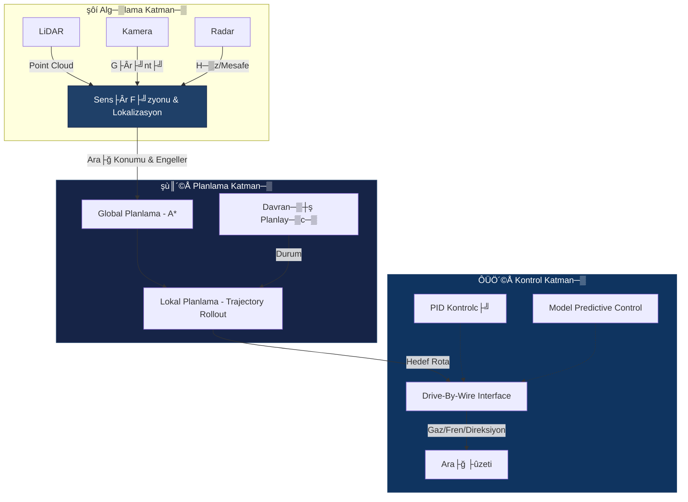

´╗┐# ´┐¢ TEKNOFEST Robotaksi Binek Otonom Ara├ğ Yar─▒┼şmas─▒
### ­şÜÇ Autonomous Passenger Transport Command Center

<div align="center">


[](https://opensource.org/licenses/MIT)
[](https://www.python.org/)
[](https://docs.ros.org/en/humble/)
[](https://github.com/bahattinyunus/teknofest_robotaksi)

**"Yolu G├Âr├╝yoruz, Gelece─şi Planl─▒yoruz."**
*"We see the road, we plan the future."*

</div>

---

## ´┐¢ G├Ârev Tan─▒m─▒ (Mission Directive)
**TEKNOFEST Robotaksi Binek Otonom Ara├ğ Yar─▒┼şmas─▒**, ┼şehir i├ği trafik senaryolar─▒nda s├╝r├╝c├╝s├╝z, g├╝venli ve kurallara uygun seyahat edebilen otonom ara├ğlar geli┼ştirmeyi hedefler. Bu depo, arac─▒n **alg─▒lama**, **planlama** ve **kontrol** yeteneklerini y├Âneten merkezi sinir sistemini bar─▒nd─▒r─▒r.

> **Hedef:** Tam otonom s├╝r├╝┼ş ile belirlenen rotay─▒ takip etmek, engellerden ka├ğ─▒nmak ve yolcular─▒ g├╝venle hedefe ula┼şt─▒rmak.

---

## ­şÅù´©Å Otonom S├╝r├╝┼ş Mimarisi (Autonomous Stack)
Bu proje, y├╝ksek performansl─▒ bir otonom s├╝r├╝┼ş y─▒─ş─▒n─▒ (stack) ├╝zerine in┼şa edilmi┼ştir.



### ­şğá ├çekirdek Mod├╝ller

#### 1. Perception (Alg─▒lama)
D├╝nyay─▒ anlamland─▒rma mod├╝l├╝.
- **YOLOv8/v11:** Trafik i┼şaretleri, yayalar ve di─şer ara├ğlar─▒n tespiti.
- **LiDAR Clustering:** DBSCAN/Euclidean Clustering ile engellerin 3D konumland─▒r─▒lmas─▒.
- **Lane Detection:** OpenCV ve Derin ├û─şrenme tabanl─▒ ┼şerit takibi.

#### 2. Planning (Planlama)
En g├╝venli ve verimli rotan─▒n hesaplanmas─▒.
- **Global Planner:** GPS koordinatlar─▒ ├╝zerinden ana g├╝zergah─▒n (Waypoints) belirlenmesi.
- **Local Planner:** Anl─▒k engellerden ka├ğ─▒nma (Obstacle Avoidance) ve h─▒z profili olu┼şturma.

#### 3. Control (Kontrol)
Fiziksel arac─▒n y├Ânetimi.
- **Pure Pursuit / Stanley:** Yanal kontrol (Direksiyon a├ğ─▒s─▒).
- **PID / MPC:** Boylamsal kontrol (H─▒z ve ivmelenme).

---

## ­şÆ╗ Command Center (CLI Dashboard)
Sistemin durumunu ger├ğek zamanl─▒ izlemek i├ğin geli┼ştirdi─şimiz "Command Center" aray├╝z├╝n├╝ deneyin.

```bash
python tools/dashboard.py
```
*Bu ara├ğ; sens├Âr verilerini, sistem sa─şl─▒─ş─▒n─▒ ve otonom s├╝r├╝┼ş loglar─▒n─▒ sim├╝le eder.*

## ­şôÜ Dok├╝mantasyon
Projenin derinlemesine teknik detaylar─▒ ve mimari kararlar i├ğin:
* [­şôû Mimarinin Derinlemesine ─░ncelemesi (Architecture Deep-Dive)](docs/ARCHITECTURE.md)

---

## ­şøá´©Å Kurulum ve Haz─▒rl─▒k (Deployment)

Projenin yerel ortamda ├ğal─▒┼şt─▒r─▒lmas─▒ i├ğin gerekli ad─▒mlar.

### Gereksinimler
* Ubuntu 22.04 LTS
* ROS 2 Humble Hawksbill
* Python 3.8+
* CUDA 11.x (YOLO e─şitimi i├ğin)

```bash
# Depoyu klonlay─▒n
git clone https://github.com/bahattinyunus/teknofest_robotaksi.git
cd teknofest_robotaksi

# Ba─ş─▒ml─▒l─▒klar─▒ y├╝kleyin
pip install -r requirements.txt

# ├çal─▒┼şma alan─▒n─▒ derleyin
colcon build --symlink-install
source install/setup.bash
```

### Sim├╝lasyon Ba┼şlatma
Proje, **Gazebo** veya **Carla** sim├╝lat├Ârleri ile entegre ├ğal─▒┼ş─▒r.
```bash
ros2 launch robotaksi_sim world.launch.py
```

---

## ­şæ¿ÔÇı­şÆ╗ Author Info

<div align="center">

**Bahattin Yunus Çetin**
*IT Architect | Software Developer | Trabzon, T├╝rkiye*

Otonom sistemler, yapay zeka ve robotik ├╝zerine tutkulu bir m├╝hendis. TEKNOFEST projelerinde inovatif ├ğ├Âz├╝mler geli┼ştirmektedir.

[](https://www.linkedin.com/in/bahattinyunus/)
[](https://github.com/bahattinyunus)

</div>

---

## ­şô£ Lisans
Bu proje [MIT Lisans─▒](LICENSE) alt─▒nda lisanslanm─▒┼şt─▒r.

*Copyright ┬® 2025 Bahattin Yunus ├çetin.*
<p align="center">
  
</p>
